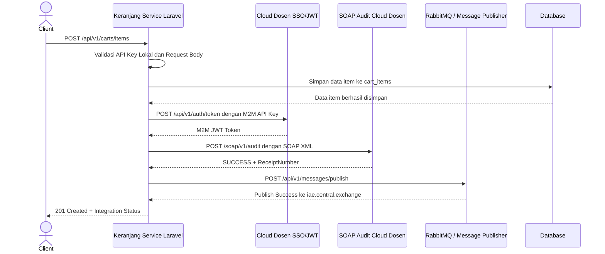

# Analisis Tugas 3 - Keranjang Service

## Identitas

Nama: M Zacky Dhaffary
NIM: 102022430021
Service: Keranjang Service
Tema: E-Commerce
Team ID: TEAM-01
Kode Kelompok: BBK2HAB3
Routing Key Event: cart.item.added

## 1. Deskripsi Service

Keranjang Service merupakan layanan yang digunakan untuk mengelola data keranjang belanja customer pada sistem E-Commerce. Service ini berperan pada proses ketika customer memasukkan produk ke dalam keranjang sebelum melanjutkan ke proses checkout dan pembuatan order.

Endpoint utama pada Keranjang Service adalah sebagai berikut:

| Method | Endpoint            | Fungsi                                    |
| ------ | ------------------- | ----------------------------------------- |
| GET    | /api/v1/carts       | Mengambil seluruh data keranjang          |
| GET    | /api/v1/carts/{id}  | Mengambil detail keranjang berdasarkan ID |
| POST   | /api/v1/carts/items | Menambahkan produk ke dalam keranjang     |

Pada Tugas 3, Keranjang Service dikembangkan agar dapat terhubung ke sistem cloud dosen melalui Federated SSO/JWT, SOAP/XML Audit, dan RabbitMQ/message publisher.

## 2. Transaksi Kritis yang Dipilih

Transaksi kritis yang dipilih adalah:

POST /api/v1/carts/items

Endpoint ini digunakan untuk menambahkan produk ke dalam keranjang belanja customer.

## 3. Justifikasi Transaksi Kritis

Endpoint POST /api/v1/carts/items dipilih sebagai transaksi kritis karena endpoint ini bersifat state-changing, yaitu mengubah data pada sistem dengan menambahkan item baru ke tabel cart_items.

Transaksi ini penting karena data keranjang akan digunakan pada proses berikutnya, yaitu checkout dan pembuatan order. Jika data produk yang masuk ke keranjang tidak valid, maka proses checkout dapat menghasilkan transaksi pembelian yang salah.

Oleh karena itu, transaksi ini perlu:

1. Diautentikasi melalui sistem keamanan terpusat menggunakan SSO/JWT.
2. Dicatat ke sistem audit legacy menggunakan SOAP/XML.
3. Dipublikasikan sebagai event bisnis ke RabbitMQ/message broker.

## 4. Modul 1 - Federated SSO/JWT

Pada modul Federated SSO, Keranjang Service menerima JWT dari sistem SSO dosen. Token JWT diperoleh melalui endpoint auth token menggunakan akun warga yang telah disediakan oleh dosen.

Akun warga yang digunakan:

* Email: [warga16@ktp.iae.id](mailto:warga16@ktp.iae.id)
* Token Type: user
* Grant Type: password

JWT yang diterima kemudian diverifikasi menggunakan public key JWKS dari sistem SSO dosen. Setelah token valid, service membaca payload token untuk mendapatkan informasi user seperti subject, token_type, grant_type, profile, dan email.

Hasil pengujian Federated SSO menunjukkan bahwa JWT berhasil diverifikasi oleh Keranjang Service dengan hasil:

* Status: success
* Message: SSO JWT verified successfully
* Subject: [warga16@ktp.iae.id](mailto:warga16@ktp.iae.id)
* Token Type: user
* Local Role: customer

Pemetaan role lokal dilakukan berdasarkan jenis token:

| Token Type dari SSO | Role Lokal |
| ------------------- | ---------- |
| user                | customer   |
| m2m                 | service    |
| lainnya             | guest      |

Dengan demikian, Keranjang Service sudah dapat menerima JWT dari cloud dosen, memverifikasi token, membaca payload, dan memetakan user ke role lokal.

## 5. Modul 2 - SOAP/XML Audit

Pada modul SOAP/XML Audit, transaksi kritis POST /api/v1/carts/items dikirimkan ke endpoint audit SOAP milik cloud dosen.

Data transaksi dikirim dalam bentuk SOAP Envelope dengan tiga elemen utama:

| Elemen SOAP  | Isi                                              |
| ------------ | ------------------------------------------------ |
| TeamID       | TEAM-01                                          |
| ActivityName | CartItemAdded                                    |
| LogContent   | Data transaksi keranjang dalam format JSON CDATA |

Contoh isi LogContent yang dikirim:

```json
{
  "nama": "M Zacky Dhaffary",
  "nim": "102022430021",
  "team": "TEAM-01",
  "kode_kelompok": "BBK2HAB3",
  "service": "Keranjang Service",
  "endpoint": "POST /api/v1/carts/items",
  "activity": "Menambahkan produk ke keranjang",
  "cart_id": 1,
  "product_id": 10,
  "product_name": "Webcam HD",
  "quantity": 1,
  "price": 180000
}
```

Hasil pengujian SOAP Audit menunjukkan bahwa cloud dosen memberikan response sukses:

* Status: SUCCESS
* Receipt Number: IAE-LOG-2026-D0C3C8E7

Receipt Number tersebut menjadi bukti bahwa transaksi kritis berhasil dicatat pada sistem audit SOAP dosen.

## 6. Modul 3 - RabbitMQ / Message Publisher

Pada modul RabbitMQ/message publisher, Keranjang Service mengirimkan event bisnis setelah transaksi penambahan produk ke keranjang berhasil dilakukan dan tercatat pada SOAP Audit.

Event yang dikirim:

cart.item.added

Payload event berisi informasi transaksi, identitas service, identitas mahasiswa, team, routing key, dan receipt number dari SOAP Audit.

Contoh payload event:

```json
{
  "event_name": "cart.item.added",
  "service_name": "Keranjang Service",
  "api_version": "v1",
  "team_id": "TEAM-01",
  "kode_kelompok": "BBK2HAB3",
  "nama": "M Zacky Dhaffary",
  "nim": "102022430021",
  "endpoint": "POST /api/v1/carts/items",
  "activity": "Menambahkan produk ke keranjang",
  "cart_id": 1,
  "product_id": 10,
  "product_name": "Webcam HD",
  "quantity": 1,
  "price": 180000,
  "legacy_receipt_number": "IAE-LOG-2026-D0C3C8E7"
}
```

Hasil pengujian RabbitMQ publish menunjukkan response:

```json
{
  "status": "success",
  "exchange": "iae.central.exchange",
  "routing_key": "cart.item.added"
}
```

Dengan hasil tersebut, event bisnis dari Keranjang Service sudah berhasil dipublikasikan ke message broker cloud dosen.

## 7. Hasil Integrasi pada Endpoint Laravel

Setelah integrasi dilakukan, endpoint lokal Laravel POST /api/v1/carts/items tidak hanya menyimpan data ke database, tetapi juga otomatis melakukan integrasi ke cloud dosen.

Alur yang terjadi:

1. Client mengirim request POST /api/v1/carts/items.
2. Keranjang Service memvalidasi request.
3. Data item disimpan ke tabel cart_items.
4. Service mengambil M2M token dari cloud dosen.
5. Service mengirim SOAP Audit.
6. Service menerima ReceiptNumber dari SOAP Audit.
7. Service mempublikasikan event cart.item.added ke RabbitMQ.
8. Service mengembalikan response 201 Created.

Hasil response dari Laravel menunjukkan:

* Product added to cart successfully
* m2m_auth status: success
* SOAP audit status: SUCCESS
* Receipt Number: IAE-LOG-2026-D0C3C8E7
* RabbitMQ publish status: success
* Exchange: iae.central.exchange
* Routing Key: cart.item.added

## 8. Sequence Diagram Internal



## 9. Evidence Pengujian

Evidence yang digunakan dalam Tugas 3:

| No | Evidence                                                                         | Status   |
| -- | -------------------------------------------------------------------------------- | -------- |
| 1  | Health check cloud dosen                                                         | Berhasil |
| 2  | M2M token menggunakan API Key                                                    | Berhasil |
| 3  | User token SSO warga16                                                           | Berhasil |
| 4  | Validasi JWT pada endpoint /api/v1/sso/verify                                    | Berhasil |
| 5  | SOAP Audit manual PowerShell                                                     | Berhasil |
| 6  | RabbitMQ Publish manual PowerShell                                               | Berhasil |
| 7  | Endpoint Laravel POST /api/v1/carts/items otomatis menjalankan SOAP dan RabbitMQ | Berhasil |

## 10. Kesimpulan

Tugas 3 merupakan pengembangan dari Keranjang Service yang telah dibuat pada Tugas 2. Pada tahap ini, Keranjang Service berhasil diintegrasikan dengan sistem cloud dosen.

Integrasi yang berhasil dilakukan meliputi Federated SSO/JWT, SOAP/XML Audit, dan RabbitMQ/message publisher. Transaksi POST /api/v1/carts/items dipilih sebagai transaksi kritis karena transaksi tersebut mengubah data keranjang dan menjadi bagian penting sebelum proses checkout.

Berdasarkan hasil pengujian, Keranjang Service sudah berhasil:

1. Memverifikasi JWT dari SSO dosen.
2. Memetakan token user menjadi role lokal customer.
3. Mengirim SOAP Audit dan menerima ReceiptNumber.
4. Mempublikasikan event cart.item.added ke RabbitMQ.
5. Mengembalikan response endpoint Laravel dengan status integrasi lengkap.
